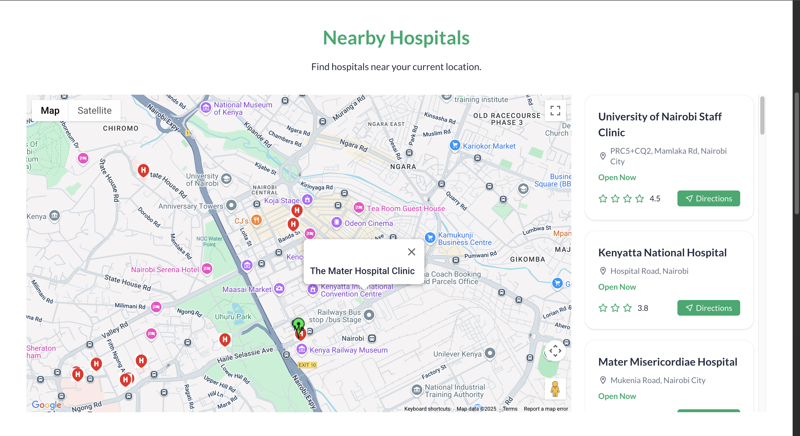

# Hospital Finder

Hospital Finder is a web application designed to help users quickly locate the nearest hospitals during emergencies. It utilizes Google Maps APIs to identify and display nearby hospitals in real-time.
Whether you're in a new city or facing a critical situation, Hospital Finder ensures that help is just a click away.

## Live Demo

[Visit Hospital Finder](https://hospital-finder-eta.vercel.app/)

### Homepage


### Map View


## Table of Contents

- [Features](#features)
- [Technologies Used](#technologies-used)
- [Installation](#installation)
- [Contributing](#contributing)
- [License](#license)

## Features

- Detects the user’s current location
- Displays nearby hospitals using the Google Maps API
- Fetches local emergency numbers by country
- Interactive map with hospital markers
- Fully responsive and mobile-friendly
- Deployed on Vercel

---

## Technologies Used

- **Next.js** – Frontend framework
- **Tailwind CSS** – Utility-first CSS styling
- **Google Maps API** – Location and mapping
- **Emergency Number API** - Get the Dispatch Emergency Number for the user's Country
- **Vercel** – Deployment and hosting

---

## Installation

1. **Clone the repository**
   ```bash
   git clone https://github.com/esthercate/Hospital-Finder.git
   cd frontend 

2. Install dependencies
   ```bash
   npm install

3. Run the development server
   ```bash
   npm run dev

4. Visit
   ```bash
   http://localhost:3000

## Contributing
Contributions are welcome! Here's how:

1. Fork the repository
2. Create a new branch (git checkout -b @your-name/feature/YourFeature)
3. Commit your changes (git commit -m 'Add new feature')
4. Push to the branch (git push origin @your-name/feature/YourFeature)
5. Open a Pull Request

## License
This project is licensed under the MIT License – see the LICENSE file for details.
